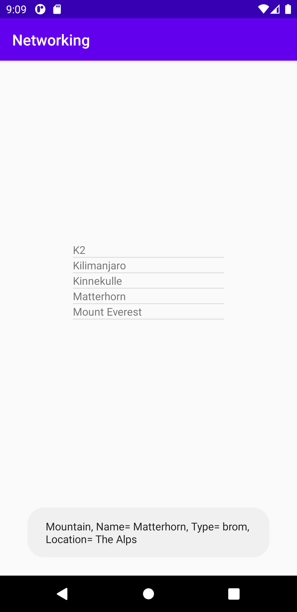
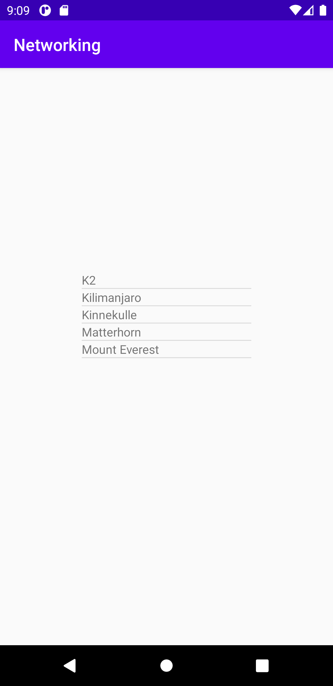

# Assignment 6
## Listview
För att skapa en listview lades det in en listview i layout filen activity_main.xml. Activity_main.xml layout filen är den filen som säger hur layouten för appen ska se ut. För att färdigställa listviewn skapades det en ny layout fil där layouten för det individuella objektet är skapat. I den skapade layout-filen vid namn list_textview.xml finns en redan implementerad textview. För att kunna koppla listviewn samt textviewn till adaptern skapades det ett id för både listviewn och textviewn. En adapter är en mellanhand mellan listviewn och datan och adapterns uppgift är att ge åtkomst till dataobjekten.

```
    <ListView
    android:id="@+id/listview"
    android:layout_width="200dp"
    android:layout_height="200dp"
    app:layout_constraintBottom_toBottomOf="parent"
    app:layout_constraintEnd_toEndOf="parent"
    app:layout_constraintStart_toStartOf="parent"
    app:layout_constraintTop_toTopOf="parent" />

    <TextView
    xmlns:android="http://schemas.android.com/apk/res/android"
    android:layout_width="match_parent"
    android:layout_height="match_parent"
    android:id="@+id/list_textview.xml">

    </TextView>
```

För att komma åt listviewn i appen användes metoden findViewById i MainActivity.java. I metoden angavs id:et för listviewn ifrån activity_main.xml.

```
    listView = findViewById(R.id.listview);
```

## Members variables
I javafilen main_acktivity.java finns det en klass vid namn MainActivity. En klass består av två saker. Den första saken är metoder som är det som talar om för appen hur den ska bete sig och den andra saken är tillståndet vilket är medlemsvariabler. Medlemsvariabler är alltså variabler som är tillgängliga i en klass. På grund av att man oftast bara vill att en medlemsvariabel ska kunnas användas i en klass skrivs private ut framför. Efter private skrevs typen ut som för Listview är ListView samt namnet på medlemsvariabeln listview. Ytterligare en medlemsvariabel deklarerades i klassen MainActivty vilket var typen Mountain[ ] med namnet mountains. [ ] betyder att det är en array vilket är arrayen som jsondatan ligger placerad i.
```
    private Mountain[] mountains;
    private ListView listView;
```

## Arraylist och Arrayadapter
Listviewn vill ha en adapter för att kunna fyllas med data. För att skapa en arrayadapter skapades det först en medlemsvariabel i form utav en arraydapter med typen Mountains med namnet adapter. För att skapa själva arrayadaptern angavs medlemsvariabeln adapter är lika med new samt ArrayAdapter<> tillsammans med contexten this samt layouten list_textview. Denna arrayadaptern skapades i try i onCreate metoden. För att sätta listviewn adapterna skrev det ut listView som är namnet på medlemsvariabeln samt setAdapter. I setAdaptern lades medlemsvariabeln för arrayadaptern in, adapter. För att JSON datan skall kunna förändras implementeras det även in en arraylist. Skillnaden mellan en arraylist mot en array är att i en arraylist kan du förändra innehållet medans i en array behövs det skapas en ny array om ny data ska implementeras. För att skapa arraylist implementerades det en medlemsvariabel i klassen MainActivity med typen Mountain och namnet list. I onCreate metoden implementeras det sedan en ny Arraylist.

```
    list = new ArrayList<>();
    adapter = new ArrayAdapter<>(this,R.layout.list_textview);
    listView = findViewById(R.id.listview);
    listView.setAdapter(adapter);
```
```
    ArrayAdapter<Mountain> adapter;
    ArrayList<Mountain> list;
```

## ASYNCTASK
För att kunna hämta datan ifrån en url implementeras det först in en Jsontask med en execute som utför url:en. Denna kodrad är placerad i metoden onCreate inuti try.

```
    new JsonTask().execute("https://wwwlab.iit.his.se/brom/kurser/mobilprog/dbservice/admin/getdataasjson.php?type=brom");
```

Därefter implementerades det in ett stycke kod för att kunna hämta jsondatan ifrån url:en. Det Asyntasken har i uppgift är att den ska köra operationer i bakgrunden. Anledningen till att man skapar en asynktask klass är för att kunna köra operationer som anses kan ta längre tid. Asyntask koden består av två delar en doInBackground som är den koden som kommer köras i bakgrunden. Och en metoden heter onPostExecute och är den som skriver ut operationen.

```
@SuppressLint("StaticFieldLeak")
private class JsonTask extends AsyncTask<String, String, String> {

   private HttpURLConnection connection = null;
   private BufferedReader reader = null;

   protected String doInBackground(String... params) {
       try {
           URL url = new URL(params[0]);
           connection = (HttpURLConnection) url.openConnection();
           connection.connect();

           InputStream stream = connection.getInputStream();
           reader = new BufferedReader(new InputStreamReader(stream));

           StringBuilder builder = new StringBuilder();
           String line;
           while ((line = reader.readLine()) != null && !isCancelled()) {
               builder.append(line).append("\n");
           }
           return builder.toString();
       } catch (MalformedURLException e) {
           e.printStackTrace();
       } catch (IOException e) {
           e.printStackTrace();
       } finally {
           if (connection != null) {
               connection.disconnect();
           }
           try {
               if (reader != null) {
                   reader.close();
               }
           } catch (IOException e) {
               e.printStackTrace();
           }
       }
       return null;
   }

   @Override
   protected void onPostExecute(String json) {
       Log.d("TASK", json);
       Gson gson = new Gson();
       mountains = gson.fromJson(json,Mountain[].class);
       adapter = new ArrayAdapter<Mountain>(MainActivity.this,R.layout.list_textview,mountains);
       listView = findViewById(R.id.listview);
       listView.setAdapter(adapter);

       for(int i = 0; i < mountains.length; i++) {
           Log.d("MainActivity ==>", "Hittade ett berg" +mountains[i].getName());
       }

   }
}
```

För att kunna exekvera ut listviewn behövs den implementeras inuti onPostExecute metoden vilket görs på samma sätt som tidigare. Med hjälp av findviewById som hämtar id:et listview. Det sätts också en ny adapter med hjälp av arrayadapter, typen Mountains samt layouten list_textview. För att kunna skriva ut namnet på bergen skapades det en for med ett villkor som säger att index (i) alltid ska läggas på med 1 vilket gör att det kommer skrivas ut ett nytt namn på ett berg så länge det finns berg tillgängliga. För att skriva ut namnet användes medlemsvariabeln mountains samt index (i) tillsammans med getname(). För att kunna parsa json användes ett GSON-bibliotek. Det första som gjordes var att implementera biblioteket. Efter det skapades det en ny class med namnet Mountain. Inuti klassen deklareras alla json filens egenskaper till privata medlemsvariabler med samma datatyp. Inuti metoden onPostExecute skapas det därefter en variabel av typen Gson med namnet gson. Därefter tilldelas variabeln mountains gson.fromJson med Mountain [ ].class. Det gör att variabeln mountains nu innehåller jsondatan.

```
private String ID;
private String name;
private String type;
private String company;
private String location;
private String category;
private int size;
private int cost;
private Auxdata auxdata;
```

## Internetåtkomst
För att kunna använda url:en för att skriva ut bergen behövs internetåtkomst. För att få tillgång till extra behörighet användes uses-permission och genom android name angavs det vad för typ av behörighet som ska läggas till.
```
<uses-permission android:name="android.permission.INTERNET" />
```

## toString()
För att skriva ut namnet på bergen användes toString inuti den nya Mountain classen. toString returnerar namnet på berget till appen vilket gör att den skriver ut namnet.
```
@Override
    public String toString() {
        return name;
    }
```

## Toast
För att skapa en toast som visas när en användare klickar på ett berg skapades det en setOnitemClicklistener av listView. Inuti setOnitemClicklistener skapades det en public void med en onItemClick. Inuti onItemClick skapades det en toast som med hjälp av medlemsvariabler mountains med index position samt getname() skriver ut en toast när användaren klickar på vilket gör att fakta om berget skrivs ut. Det som gör att rätt fakta skrivs ut är på grund av medlemsvariabler mountains har index position.

```
listView.setOnItemClickListener(new AdapterView.OnItemClickListener() {
   @Override
   public void onItemClick(AdapterView<?> parent, View view, int position, long id) {
       Toast.makeText(getApplicationContext(),mountains[position].getName(),Toast.LENGTH_LONG).show();
   }
});
```


## Getname()
För att kunna skriva ut fakta om berget när en användaren klickar på berget i listviewn skapades det en getname() i Mountain.java. I generate valdes namn, type och location som den datan som ska skrivas ut i toasten. När getName() sedan används returneras namnet typen och platsen för berget.

```
public String getName() {
   return "Mountain" +
           ", Name= " + name +
           ", Type= " + type +
           ", Location= " + location;
}
```

## Asset folder
För att få en förståelse över JSON data skapades det en directory i asset foldern där JSON kod implementerades. Utifrån ett intresseperspektiv skapades hela processen först för att läsa av den interna filen för att sedan läsa av data ifrån en internet server.


## Listviewns utseende

